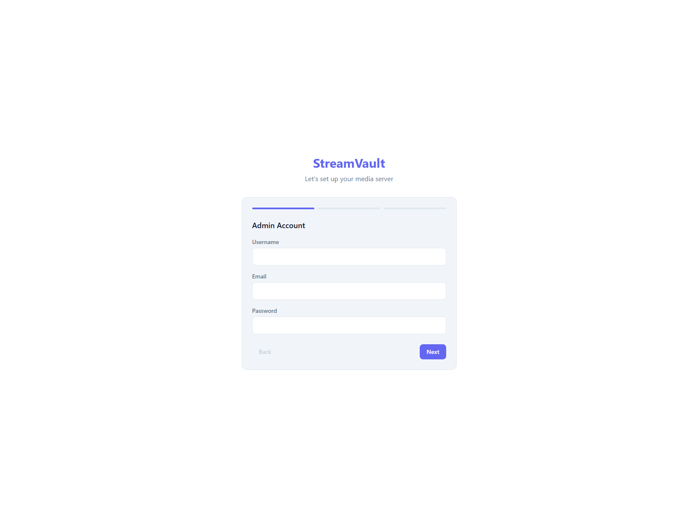
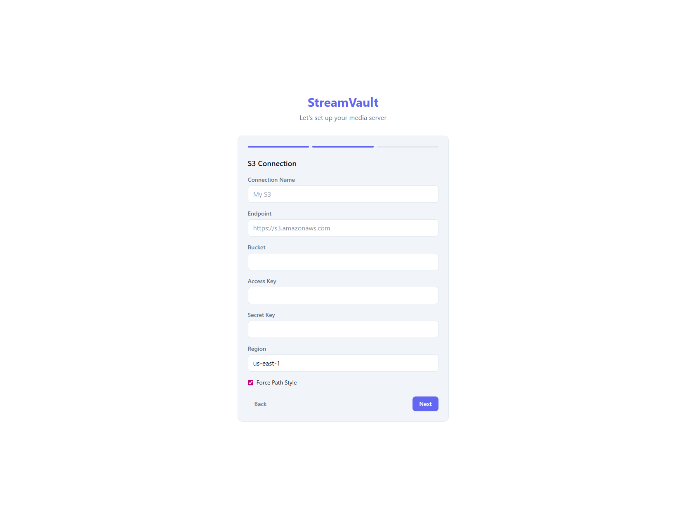
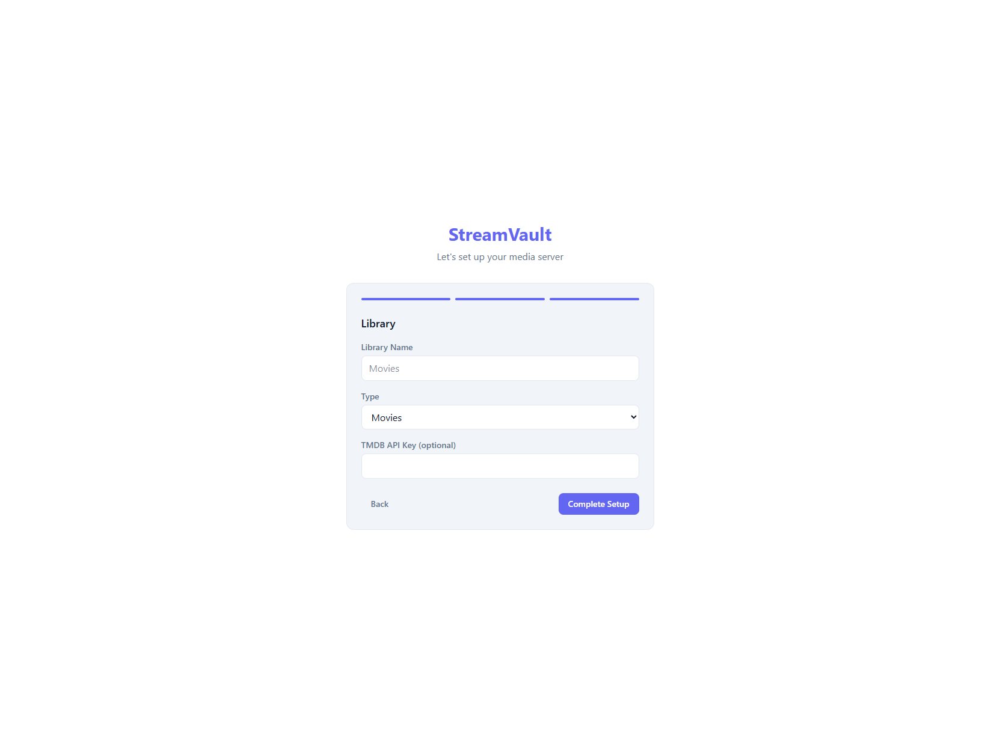
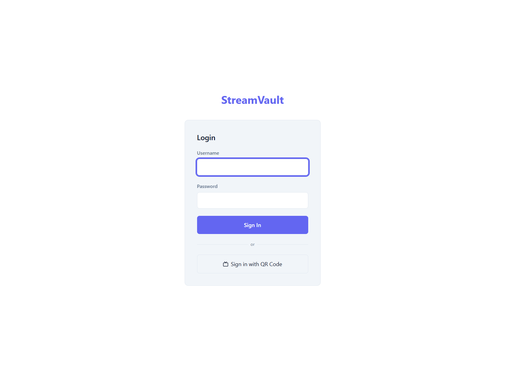
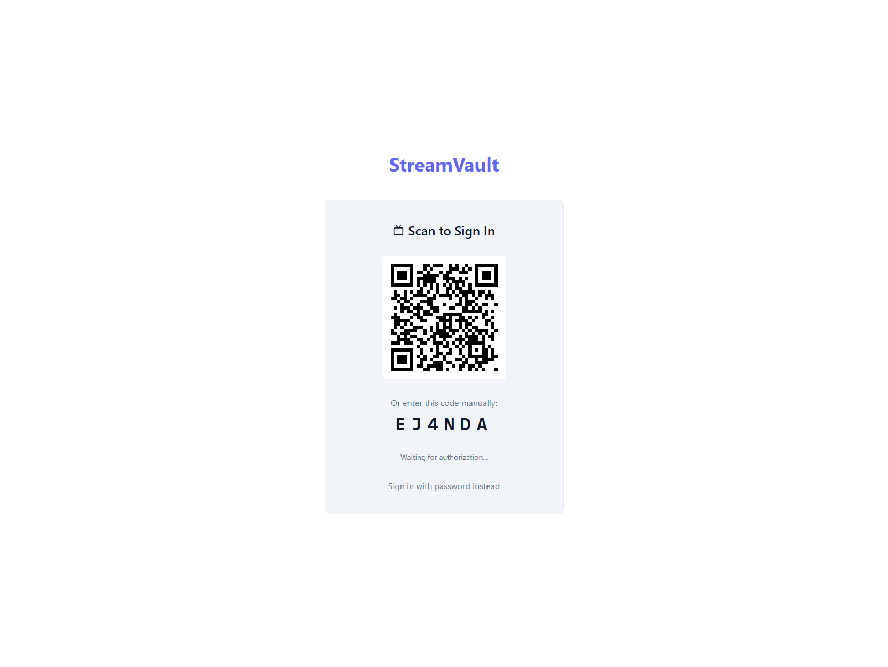
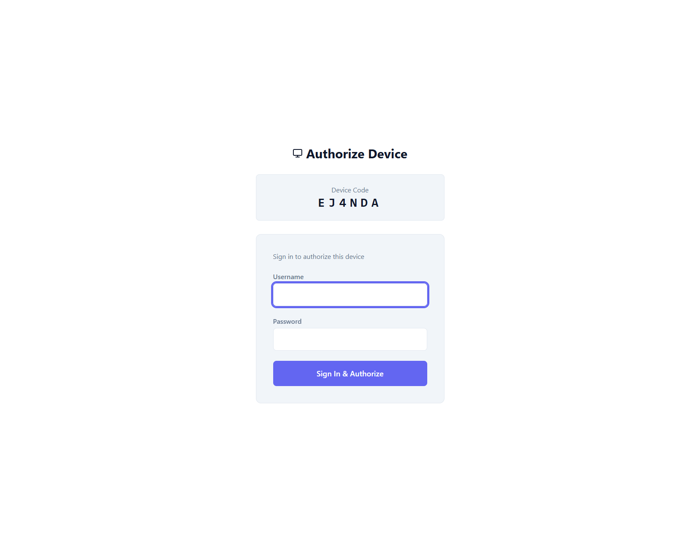
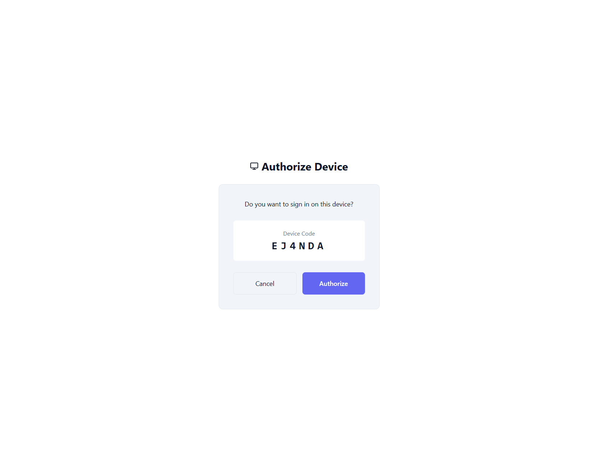
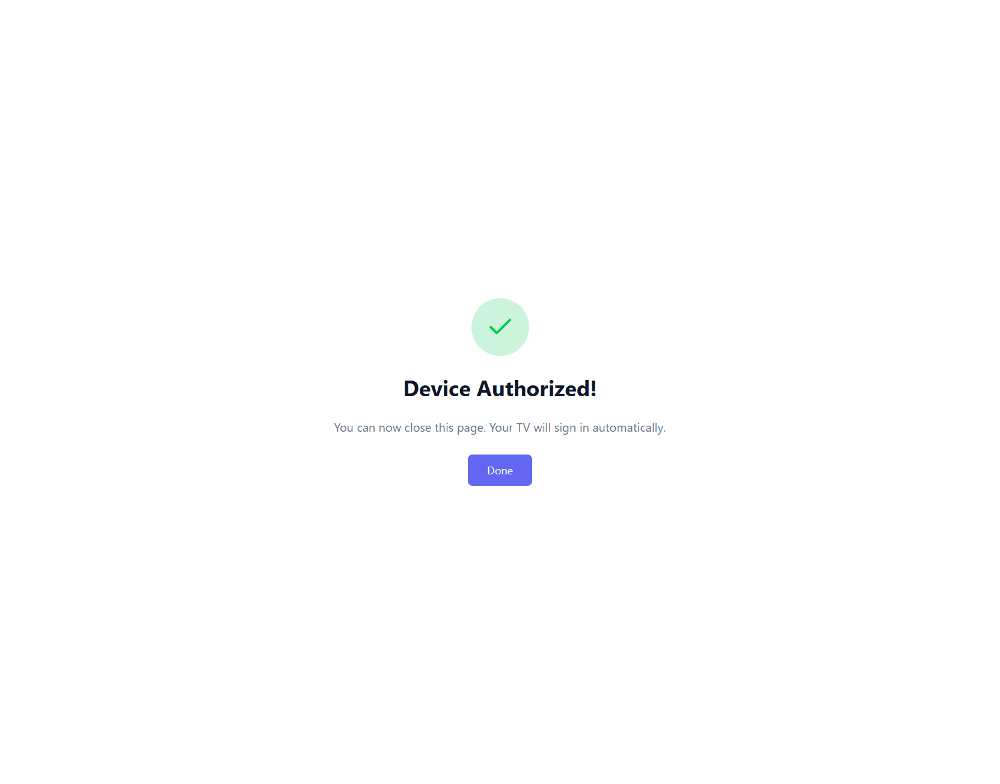
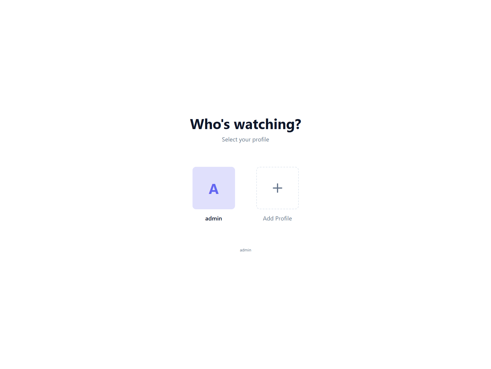

# StreamVault — Getting Started Guide

This guide walks you through deploying StreamVault locally with Docker and covers the initial setup, profile system, and QR code login for TV devices.

## Prerequisites

- [Docker Desktop](https://www.docker.com/products/docker-desktop/) installed and running
- An S3-compatible storage backend (e.g. [MinIO](https://min.io/), AWS S3, Wasabi, Backblaze B2)

## 1. Deploy with Docker

```sh
# Clone and start
git clone https://github.com/SymoHTL/Streamvault.git
cd Streamvault

# Start with local docker-compose
docker compose -f docker-compose.local.yml up --build -d
```

This builds the full app (React frontend + .NET backend + ffmpeg) and starts it alongside a Redis instance. StreamVault will be available at **http://localhost:8080**.

> The `data-local/` directory is mounted as a volume — your database and logs persist between restarts.

### Start Fresh

To wipe everything and start over:

```sh
docker compose -f docker-compose.local.yml down
rm -f data-local/streamvault.db*
rm -rf data-local/keys
docker compose -f docker-compose.local.yml up -d
```

## 2. Initial Setup

Open http://localhost:8080 — you'll be redirected to the setup wizard.

### Step 1: Admin Account

Create your admin account with a username, email, and password.



### Step 2: S3 Connection

Configure your S3-compatible storage. If you're using MinIO locally:

| Field            | Example Value      |
| ---------------- | ------------------ |
| Connection Name  | Local MinIO        |
| Endpoint         | http://minio:9000  |
| Bucket           | my-media           |
| Access Key       | minioadmin         |
| Secret Key       | minioadmin         |
| Region           | us-east-1          |
| Force Path Style | ✅ (for MinIO)     |



### Step 3: Library

Create your first media library. Choose a name and type (Movies or TV Shows). You can optionally add a [TMDB API key](https://www.themoviedb.org/settings/api) for automatic metadata fetching.



Click **Complete Setup** — you'll be logged in and taken to the profile picker.

## 3. Profiles

StreamVault supports Netflix-style multi-profile per account (up to 5). After setup, a default profile is created with your admin username.


- Click a profile to enter the app
- Click **Add Profile** to create additional profiles (with optional PIN protection)
- Hover a profile to see the delete button

## 4. The App

After selecting a profile, you'll see the main interface with your library, search, lists, and collections.


## 5. QR Code Login (TV / Device Auth)

StreamVault supports QR code login — perfect for TVs and devices where typing passwords is awkward.

### How it works

1. **On the TV**: Go to the login page and click **Sign in with QR Code**

   

2. **On the TV**: A QR code appears along with a 6-character user code. The TV starts polling for authorization.

   

3. **On your phone**: Scan the QR code (or navigate to the URL manually). You'll see the device authorization page with the code pre-filled. Sign in with your credentials.

   

4. **On your phone**: Confirm you want to authorize this device.

   

5. **On your phone**: Success! The device is authorized — you can close the page.

   

6. **On the TV**: The TV automatically detects the authorization and shows the profile picker — you're logged in!

   

### Technical Details

- Device codes expire after **10 minutes**
- The TV polls every **5 seconds** for authorization status
- Codes use uppercase letters + digits (no ambiguous characters like I/O/0/1)
- Sessions use **90-day refresh tokens** — TVs won't need to re-authenticate frequently

## 6. Multi-Account Support

StreamVault supports multiple accounts signed in simultaneously:

- From the login page, use **Add Account** to sign in with additional accounts
- The **Account Picker** lets you switch between signed-in accounts
- Each account has its own set of profiles, watch history, and lists
- Logging out one account doesn't affect others

## Environment Variables

| Variable                    | Description                          | Default   |
| --------------------------- | ------------------------------------ | --------- |
| `DataDirectory`             | Path for DB, logs, keys              | `/data`   |
| `Redis__ConnectionString`   | Redis connection string              | —         |
| `Jwt__Secret`               | JWT signing key (min 32 chars)       | —         |
| `Tmdb__ApiKey`              | TMDB API key for metadata            | —         |
| `Transcoding__FfmpegPath`   | Path to ffmpeg binary                | `ffmpeg`  |
| `ASPNETCORE_ENVIRONMENT`    | `Development` or `Production`        | `Production` |
| `CorsOrigins__0`            | Allowed CORS origin                  | —         |

## Health Check

```sh
curl http://localhost:8080/health
```
